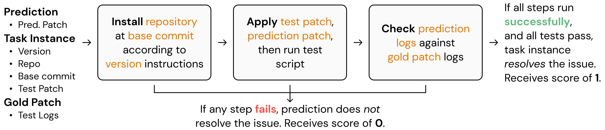

# Evaluating with SWE-bench
John Yang &bull; November 6, 2023

In this tutorial, we will explain how to evaluate models and methods using SWE-bench.

## 🤖 Creating Predictions
For each task instance of the SWE-bench dataset, given an issue (`problem_statement`) + codebase (`repo` + `base_commit`), your model should attempt to write a diff patch prediction. For full details on the SWE-bench task, please refer to Section 2 of the main paper.

Each prediction must be formatted as follows:
```json
{
    "instance_id": "<Unique task instance ID>",
    "prediction": "<.patch file content string>",
    "model": "<Model name here (i.e. SWE-Llama-13b)>",
}
```

Store multiple predictions in a `.json` file formatted as `[<prediction 1>, <prediction 2>,... <prediction n>]`. It is not necessary to generate predictions for every task instance.

## 🔄 Running Evaluation
To run evalution, modify then run the `harness/run_evaluation.sh` script, which invokes the `run_evaluation.py` script. The following arguments are necessary:

```bash
python run_evaluation.py \
    --predictions_path <Path to predictions .json file> \
    --swe_bench_tasks <Path to `swe-bench.json` file> \
    --log_dir <Path to folder to write per-task instance logs to> \
    --testbed <Path to temporary directory to execute each task instance>
```

Additional arguments are defined in `run_evaluation.py`. The following diagram captures, at a high level, what `run_evaluation.py` does. More details are provided in `harness/` and the Appendix of the main paper.

<div align="center">
    
</div>

## 📈 Metrics

Upon the successful completion of `./run_evaluation.sh`, a log file should have been created for each prediction and stored within `log_dir`, where the log file is named with the following format: `<instance_id>.<model>.eval.log`.


To get the evaluation results of a model, use the `get_model_report` function within `metrics/report.py`. It takes the same set of parameters as `harness/run_evaluation.sh`

Here is a code snippet demonstrating its proper usage:

```python
model = "Model name (same as moniker used for predictions)"
predictions_path = "Path to predictions .json file"
swe_bench_tasks = "Path to `swe-bench.json` file"
log_dir = "Path to folder with per-task instance logs (same as `log_dir` from above)"

report = get_model_report(model, predictions_path, swe_bench_tasks, log_dir)

none = sum([len(v['none']) for k, v in report.items() if isinstance(v, dict)])
generated = sum([len(v['generated']) for k, v in report.items() if isinstance(v, dict)])
with_logs = sum([len(v['with_logs']) for k, v in report.items() if isinstance(v, dict)])
applied = sum([len(v['applied']) for k, v in report.items() if isinstance(v, dict)])
resolved = sum([len(v['resolved']) for k, v in report.items() if isinstance(v, dict)])

print(f"{model} Evaluation Report:")
print(f"\tNone:      {none}")
print(f"\tGenerated: {generated}")
print(f"\tWith Logs: {with_logs}")
print(f"\tApplied:   {applied}")
print(f"\tResolved:  {resolved}")
```

Given the model name, he `get_model_report` function returns a dictionary formatted as follows:
```json
{
    "<repository>": {
        "none": ["instance_ids"],
        "generated": ["instance_ids"],
        "with_logs": ["instance_ids"],
        "applied": ["instance_ids"],
        "resolved": ["instance_ids"]
    }
}
```

Each key-value entry is a pairing of a repository with the outcome of each prediction, identified by `instance_id`:
* `none`: The prediction was `None`.
* `generated`: The prediction was non-empty.
* `with_logs`: A log file was created for this prediction (should `=` no. of `generated`).
* `applied`: The prediction was applied as a patch successfully (should `<= with_logs`).
* `resolved`: The prediction passed all tests (should `<= applied`).

